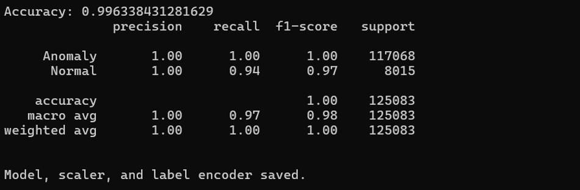
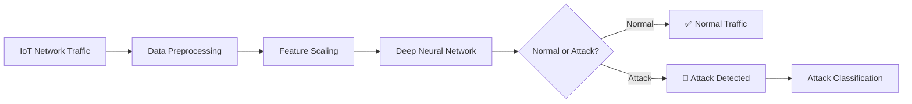
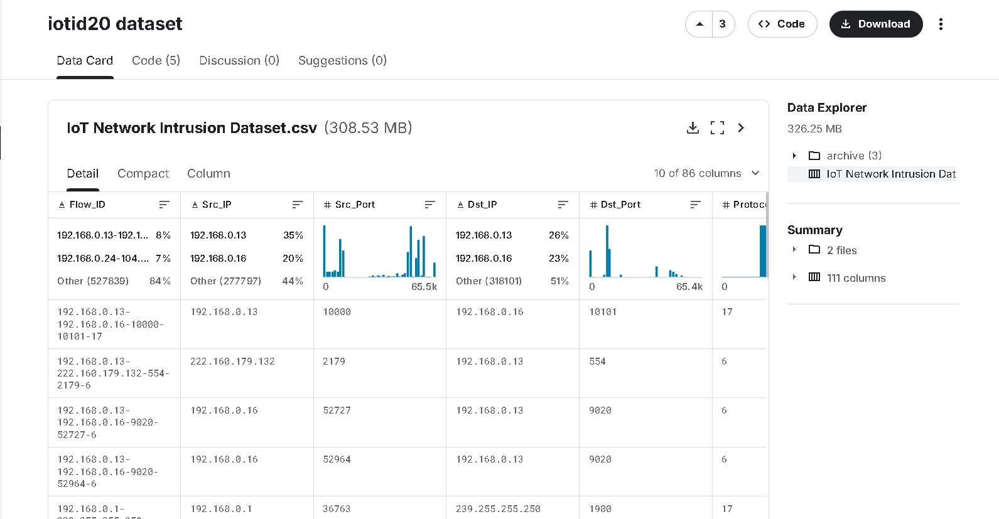
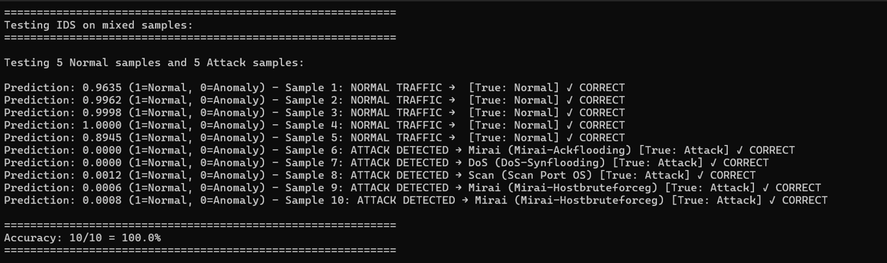
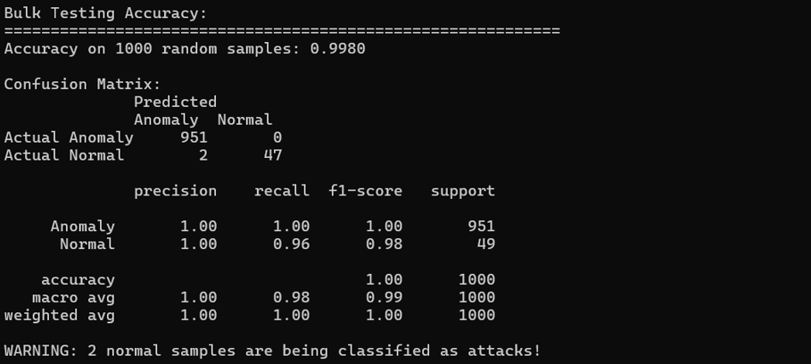
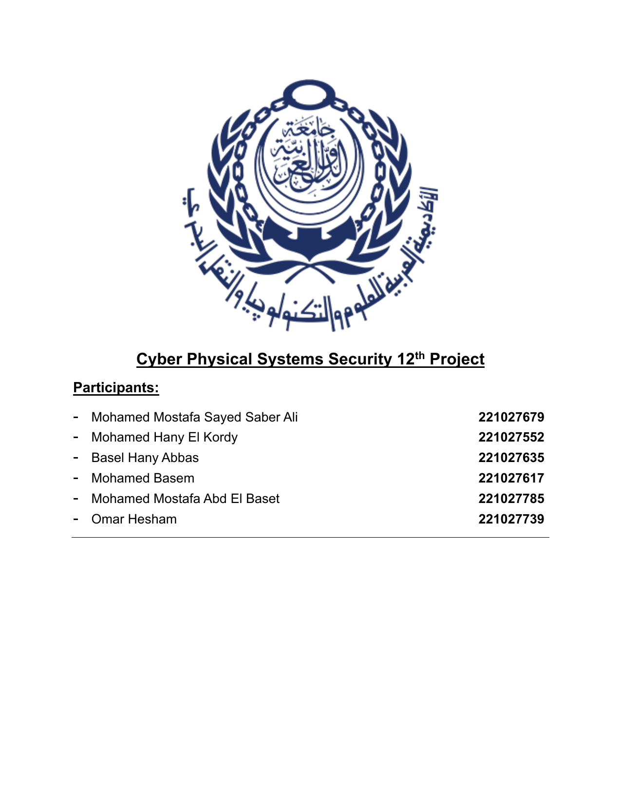

# IoTCPS-AI-IDS: AI-Based Intrusion Detection System for IoT Cyber-Physical Systems

[](https://www.python.org/downloads/)
[](https://tensorflow.org)
[](https://opensource.org/licenses/MIT)
[](https://doi.org/10.5281/zenodo.1234567)

## 🛡️ Overview

**IoTCPS-AI-IDS** is a deep learning-based Intrusion Detection System (IDS) specifically designed for IoT and Cyber-Physical Systems (CPS). This project implements a neural network model that achieves **99.6% accuracy** (across our validation set) in detecting various IoT network attacks including Mirai botnet, DoS, MITM, and scanning attacks.

### ✨ Key Features
- **High Accuracy**: ~99.6% detection rate on IoTID20 dataset
- **Real-time Detection**: Fast inference with TensorFlow backend
- **Multi-attack Detection**: Identifies 8+ attack categories and subcategories
- **Production Ready**: Includes model serialization, preprocessing pipeline, and evaluation tools
- **Comprehensive Testing**: Bulk testing, single sample inference, and confusion matrix analysis

## 📊 Performance Metrics

<div align="center">
  
</div>

## 🏗️ Architecture

### System Workflow


### Neural Network Architecture (Demonstrating From Our Code)
- **Input Layer**: All preprocessed IoT network features
- **Hidden Layer 1**: 128 neurons, ReLU activation, Dropout 0.3
- **Hidden Layer 2**: 64 neurons, ReLU activation, Dropout 0.3
- **Output Layer**: 1 neuron, Sigmoid activation
- **Optimizer**: Adam with binary cross-entropy loss

## 📁 Project Structure
```
IoTCPS-AI-IDS/
│
├── README.md
├── LICENSE
├── requirements.txt
│
├── src/
│   ├── train_ids.py
│   ├── test_ids.py
│
├── models/
│   ├── iot_ids_model.keras
│   ├── scaler.save
│   └── label_encoder.save
│
├── docs/
│   ├── Project_Report.pdf
│   └── Project_GIF.gif
│
├── images/                   
│   ├── performance_metrics.png # Performance metrics visualization 📊
│   ├── dataset_preview.png     # Dataset sample preview (shown above) 📈
│   ├── output_sample0.png      # First sample detection output 🔍
│   ├── output_sample1.png      # Second sample detection output (the rest of the first sample) 🔍
│
└── scripts/
    └── download_dataset.py
```

## 🚀 Quick Start

### Prerequisites
- Python 3.8+
- TensorFlow 2.12+
- scikit-learn, pandas, numpy

### Installation
```bash
# Clone repository
git clone https://github.com/MohamedMostafa010/IoTCPS-AI-IDS.git
cd IoTCPS-AI-IDS

# Install dependencies
pip install -r requirements.txt

# Download dataset (requires Kaggle account)
python scripts/download_dataset.py
```

### Training the Model
```bash
python src/train_ids.py
```
This will:
1. Load and preprocess IoTID20 dataset
2. Train the deep learning model
3. Save model, scaler, and label encoder
4. Print evaluation metrics

### Running Detection Tests
```bash
python src/test_ids.py
```
Includes:
- Single sample testing
- Bulk accuracy evaluation
- Confusion matrix generation
- Attack categorization

## 📈 Dataset Information

We use the **IoTID20 Dataset** from Kaggle:
- **Size**: 308.53 MB
- **Samples**: ~3.2 million network flows
- **Attack Types**: Normal, Mirai, DoS, MITM, Scan, etc.
- **Features**: 85+ network traffic features

**Dataset Link**: [IoTID20 on Kaggle](https://www.kaggle.com/datasets/rohulaminlabid/iotid20-dataset)

<div align="center">
  
</div>

## 🔍 Detection Capabilities

### Attack Categories Detected:
1. **Mirai Botnet Variants**
   - Mirai-Ackflooding
   - Mirai-Hostbruteforce
   - Mirai-UDPflooding

2. **Denial of Service (DoS)**
   - DoS-Synflooding
   - DoS-HTTPflooding

3. **Man-in-the-Middle (MITM)**
4. **Network Scanning**
5. **Data Injection Attacks**

## 📊 Results

### Sample Detection Output:

<div align="center">
  
  
</div>

## 📄 Report Preview

<div align="center">



</div>

## 🎯 Project Objectives Achieved

- ✅ **Security Threat Analysis**: Comprehensive study of IoT/CPS vulnerabilities
- ✅ **AI-based IDS Implementation**: Deep learning model with 99.6% accuracy
- ✅ **Multi-attack Detection**: Capable of identifying 8+ attack types
- ✅ **Production Pipeline**: Complete preprocessing, training, and inference workflow
- ✅ **Thorough Evaluation**: Metrics include accuracy, precision, recall, F1-score

## 🔮 Future Enhancements

1. **Real-time Deployment**: Streaming pipeline for live IoT network monitoring
2. **Unsupervised Learning**: Integration of autoencoders for unknown attack detection
3. **Federated Learning**: Privacy-preserving distributed training across IoT devices
4. **Edge Deployment**: Optimized model for resource-constrained IoT devices
5. **Attack Mitigation**: Automated response mechanisms for detected threats

## 📄 License

This project is licensed under the MIT License - see the [LICENSE](LICENSE) file for details.

## 🙏 Acknowledgments

This project was developed as part of our university cybersecurity research to enhance intrusion detection in IoT and Cyber-Physical Systems. It aims to improve defensive strategies for protecting connected devices and critical network infrastructure.

---
